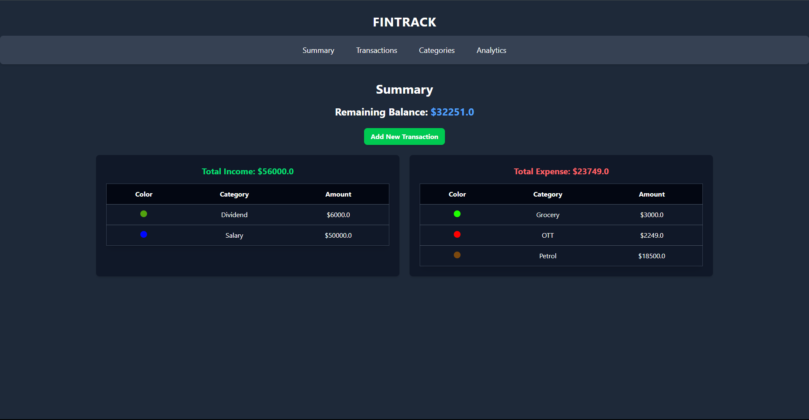

<!-- FinTrack Header -->

<p align="center">
  
</p>

<h1 align="center">💸 FinTrack</h1>
<p align="center"><b>Personal finance dashboard to track income, expenses, and visualize spending patterns.</b></p>
<p align="center">Built with Flask, SQLite, and TailwindCSS</p>


## 📊 Features

- 🔐 Secure login-free local storage (via SQLite)
- 💰 Add & categorize income or expenses
- 📅 Filter & sort transactions by category or amount
- 📈 Interactive analytics: savings trends, income vs expenses, top expenses
- 🎨 Custom chart colors per category
- 🗂️ Manage income & expense categories easily


## ⚙️ Tech Stack


## 🖼️ Screenshots

| Summary | Transactions |
|--------|--------------|
|  |  |

| Categories | Analytics |
|-----------|-----------|
|  |  |


## 🚀 Getting Started

### 1. Clone the Repository

```bash
git clone https://github.com/notgautham/FinTrack.git
cd FinTrack
````

### 2. (Optional) Create Virtual Environment

```bash
python -m venv venv
source venv/bin/activate      # On Windows: venv\Scripts\activate
```

### 3. Install Dependencies

```bash
pip install Flask Flask_SQLAlchemy
```

### 4. Run the Application

```bash
python app.py
```

### 5. Visit [http://localhost:5000](http://localhost:5000) in your browser.


### 🛑 The app auto-generates a local `finance.db` SQLite file on first run. No setup needed.


## 📁 Project Structure

```
FinTrack/
│
├── app.py                # Main Flask app with all routes
├── finance.db            # Auto-generated SQLite database
├── /templates            # HTML templates (Jinja2)
├── /static               # Tailwind CSS & JS files
├── /screenshots          # UI screenshots (for README)
└── requirements.txt      # Python dependencies (optional)
```


